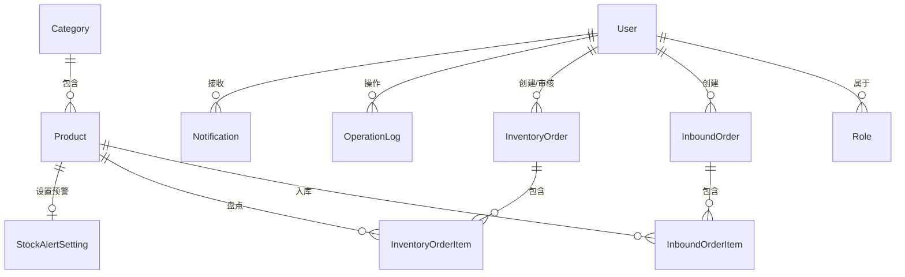

# 数据库设计文档 - 库存预备齐库存管理系统

## 一、ER图（实体关系图）



## 二、表结构设计

### 1. 用户表（user）

| 字段名 | 类型 | 长度 | 主键 | 外键 | 非空 | 默认值 | 注释 |
|-------|------|------|------|------|------|--------|------|
| id | bigint | - | 是 | - | 是 | - | 用户ID |
| username | varchar | 50 | 否 | - | 是 | - | 用户名（登录名） |
| password | varchar | 255 | 否 | - | 是 | - | 密码（加密存储） |
| real_name | varchar | 50 | 否 | - | 否 | - | 真实姓名 |
| phone | varchar | 20 | 否 | - | 否 | - | 手机号 |
| role_id | bigint | - | 否 | role(id) | 是 | - | 角色ID |
| status | tinyint | - | 否 | - | 是 | 1 | 状态（1=正常，0=禁用） |
| last_login_time | datetime | - | 否 | - | 否 | - | 最后登录时间 |
| created_at | datetime | - | 否 | - | 是 | CURRENT_TIMESTAMP | 创建时间 |
| updated_at | datetime | - | 否 | - | 是 | CURRENT_TIMESTAMP | 更新时间 |

**索引**：
- 主键索引：id
- 唯一索引：username
- 普通索引：role_id

---

### 2. 角色表（role）

| 字段名 | 类型 | 长度 | 主键 | 外键 | 非空 | 默认值 | 注释 |
|-------|------|------|------|------|------|--------|------|
| id | bigint | - | 是 | - | 是 | - | 角色ID |
| role_name | varchar | 50 | 否 | - | 是 | - | 角色名称（如"店主"、"店员"） |
| permissions | json | - | 否 | - | 否 | - | 权限配置（JSON格式） |
| description | varchar | 255 | 否 | - | 否 | - | 角色描述 |
| created_at | datetime | - | 否 | - | 是 | CURRENT_TIMESTAMP | 创建时间 |
| updated_at | datetime | - | 否 | - | 是 | CURRENT_TIMESTAMP | 更新时间 |

**索引**：
- 主键索引：id
- 唯一索引：role_name

**权限配置JSON示例**：
```json
{
  "product_manage": true,
  "inbound_manage": true,
  "inventory_manage": true,
  "inventory_audit": false,
  "stock_query": true,
  "stock_value_query": false,
  "analytics_query": false,
  "alert_manage": false,
  "log_query": false,
  "permission_manage": false
}
```

---

### 3. 商品分类表（category）

| 字段名 | 类型 | 长度 | 主键 | 外键 | 非空 | 默认值 | 注释 |
|-------|------|------|------|------|------|--------|------|
| id | bigint | - | 是 | - | 是 | - | 分类ID |
| category_name | varchar | 50 | 否 | - | 是 | - | 分类名称 |
| parent_id | bigint | - | 否 | - | 否 | 0 | 父分类ID（0=一级分类） |
| sort_order | int | - | 否 | - | 是 | 0 | 排序号 |
| status | tinyint | - | 否 | - | 是 | 1 | 状态（1=正常，0=禁用） |
| created_at | datetime | - | 否 | - | 是 | CURRENT_TIMESTAMP | 创建时间 |
| updated_at | datetime | - | 否 | - | 是 | CURRENT_TIMESTAMP | 更新时间 |

**索引**：
- 主键索引：id
- 普通索引：parent_id

---

### 4. 商品表（product）

| 字段名 | 类型 | 长度 | 主键 | 外键 | 非空 | 默认值 | 注释 |
|-------|------|------|------|------|------|--------|------|
| id | bigint | - | 是 | - | 是 | - | 商品ID |
| sku_code | varchar | 50 | 否 | - | 是 | - | 商品SKU编码（如KW-TOY-001） |
| product_name | varchar | 100 | 否 | - | 是 | - | 商品名称 |
| category_id | bigint | - | 否 | category(id) | 是 | - | 分类ID |
| cost_price | decimal | 10,2 | 否 | - | 是 | 0.00 | 加权平均成本 |
| retail_price | decimal | 10,2 | 否 | - | 是 | 0.00 | 零售价 |
| stock_quantity | int | - | 否 | - | 是 | 0 | 当前库存数量 |
| barcode | varchar | 100 | 否 | - | 否 | - | 商品包装条形码/二维码内容，非空唯一 |
| qr_code | varchar | 255 | 否 | - | 否 | - | 二维码图片路径 |
| images | text | - | 否 | - | 否 | - | 商品图片JSON数组，最多4张 |
| status | tinyint | - | 否 | - | 是 | 1 | 状态（1=正常，0=下架） |
| created_at | datetime | - | 否 | - | 是 | CURRENT_TIMESTAMP | 创建时间 |
| updated_at | datetime | - | 否 | - | 是 | CURRENT_TIMESTAMP | 更新时间 |

**索引**：
- 主键索引：id
- 唯一索引：sku_code
- 普通索引：category_id
- 普通索引：product_name

---

### 5. 入库单表（inbound_order）

| 字段名 | 类型 | 长度 | 主键 | 外键 | 非空 | 默认值 | 注释 |
|-------|------|------|------|------|------|--------|------|
| id | bigint | - | 是 | - | 是 | - | 入库单ID |
| order_no | varchar | 50 | 否 | - | 是 | - | 入库单号（如RK-20260428-001） |
| user_id | bigint | - | 否 | user(id) | 是 | - | 操作人ID |
| total_quantity | int | - | 否 | - | 是 | 0 | 总数量 |
| total_amount | decimal | 10,2 | 否 | - | 是 | 0.00 | 总金额 |
| status | tinyint | - | 否 | - | 是 | 1 | 状态（1=已完成，2=草稿） |
| remark | varchar | 255 | 否 | - | 否 | - | 备注 |
| created_at | datetime | - | 否 | - | 是 | CURRENT_TIMESTAMP | 创建时间 |
| updated_at | datetime | - | 否 | - | 是 | CURRENT_TIMESTAMP | 更新时间 |

**索引**：
- 主键索引：id
- 唯一索引：order_no
- 普通索引：user_id
- 普通索引：created_at

---

### 6. 入库单明细表（inbound_order_item）

| 字段名 | 类型 | 长度 | 主键 | 外键 | 非空 | 默认值 | 注释 |
|-------|------|------|------|------|------|--------|------|
| id | bigint | - | 是 | - | 是 | - | 明细ID |
| order_id | bigint | - | 否 | inbound_order(id) | 是 | - | 入库单ID |
| product_id | bigint | - | 否 | product(id) | 是 | - | 商品ID |
| quantity | int | - | 否 | - | 是 | 0 | 入库数量 |
| unit_price | decimal | 10,2 | 否 | - | 是 | 0.00 | 进货单价 |
| total_price | decimal | 10,2 | 否 | - | 是 | 0.00 | 总价（数量×单价） |
| created_at | datetime | - | 否 | - | 是 | CURRENT_TIMESTAMP | 创建时间 |
| updated_at | datetime | - | 否 | - | 是 | CURRENT_TIMESTAMP | 更新时间 |

**索引**：
- 主键索引：id
- 普通索引：order_id
- 普通索引：product_id

---

### 7. 盘点单表（inventory_order）

| 字段名 | 类型 | 长度 | 主键 | 外键 | 非空 | 默认值 | 注释 |
|-------|------|------|------|------|------|--------|------|
| id | bigint | - | 是 | - | 是 | - | 盘点单ID |
| order_no | varchar | 50 | 否 | - | 是 | - | 盘点单号（如PD-20260428-001） |
| user_id | bigint | - | 否 | user(id) | 是 | - | 盘点人ID |
| audit_user_id | bigint | - | 否 | user(id) | 否 | - | 审核人ID |
| inventory_type | tinyint | - | 否 | - | 是 | 1 | 盘点类型（1=临时盘点，2=定期盘点） |
| inventory_scope | varchar | 255 | 否 | - | 否 | - | 盘点范围（如"全部商品"、"模型玩偶"） |
| total_quantity | int | - | 否 | - | 是 | 0 | 盘点总数量 |
| status | tinyint | - | 否 | - | 是 | 1 | 状态（1=盘点中，2=待审核，3=已完成） |
| audit_status | tinyint | - | 否 | - | 否 | - | 审核状态（1=通过，2=驳回） |
| audit_opinion | varchar | 255 | 否 | - | 否 | - | 审核意见 |
| remark | varchar | 255 | 否 | - | 否 | - | 备注 |
| created_at | datetime | - | 否 | - | 是 | CURRENT_TIMESTAMP | 创建时间 |
| updated_at | datetime | - | 否 | - | 是 | CURRENT_TIMESTAMP | 更新时间 |
| audited_at | datetime | - | 否 | - | 否 | - | 审核时间 |

**索引**：
- 主键索引：id
- 唯一索引：order_no
- 普通索引：user_id
- 普通索引：status
- 普通索引：created_at

---

### 8. 盘点单明细表（inventory_order_item）

| 字段名 | 类型 | 长度 | 主键 | 外键 | 非空 | 默认值 | 注释 |
|-------|------|------|------|------|------|--------|------|
| id | bigint | - | 是 | - | 是 | - | 明细ID |
| order_id | bigint | - | 否 | inventory_order(id) | 是 | - | 盘点单ID |
| product_id | bigint | - | 否 | product(id) | 是 | - | 商品ID |
| system_quantity | int | - | 否 | - | 是 | 0 | 系统库存数量 |
| actual_quantity | int | - | 否 | - | 否 | - | 实际盘点数量 |
| difference | int | - | 否 | - | 否 | - | 差异数量（实际-系统） |
| difference_amount | decimal | 10,2 | 否 | - | 否 | - | 差异金额（差异数量 × 加权平均成本） |
| status | tinyint | - | 否 | - | 是 | 1 | 状态（1=未盘，2=已盘） |
| created_at | datetime | - | 否 | - | 是 | CURRENT_TIMESTAMP | 创建时间 |
| updated_at | datetime | - | 否 | - | 是 | CURRENT_TIMESTAMP | 更新时间 |

**索引**：
- 主键索引：id
- 普通索引：order_id
- 普通索引：product_id

---

### 9. 库存预警设置表（stock_alert_setting）

| 字段名 | 类型 | 长度 | 主键 | 外键 | 非空 | 默认值 | 注释 |
|-------|------|------|------|------|------|--------|------|
| id | bigint | - | 是 | - | 是 | - | 设置ID |
| product_id | bigint | - | 否 | product(id) | 是 | - | 商品ID |
| alert_threshold | int | - | 否 | - | 是 | 0 | 预警阈值 |
| is_active | tinyint | - | 否 | - | 是 | 1 | 是否启用（1=启用，0=禁用） |
| created_at | datetime | - | 否 | - | 是 | CURRENT_TIMESTAMP | 创建时间 |
| updated_at | datetime | - | 否 | - | 是 | CURRENT_TIMESTAMP | 更新时间 |

**索引**：
- 主键索引：id
- 普通索引：product_id

---

### 10. 库存流水表（stock_movement）

| 字段名 | 类型 | 长度 | 主键 | 外键 | 非空 | 默认值 | 注释 |
|-------|------|------|------|------|------|--------|------|
| id | bigint | - | 是 | - | 是 | - | 流水ID |
| product_id | bigint | - | 否 | product(id) | 是 | - | 商品ID |
| movement_type | varchar | 30 | 否 | - | 是 | - | inbound/outbound/inventory_adjust/manual_adjust |
| quantity | int | - | 否 | - | 是 | - | 变动数量，正数入库，负数出库 |
| before_quantity | int | - | 否 | - | 是 | - | 变动前库存 |
| after_quantity | int | - | 否 | - | 是 | - | 变动后库存 |
| unit_cost | decimal | 10,2 | 否 | - | 否 | - | 变动时成本价 |
| reference_type | varchar | 30 | 否 | - | 否 | - | 关联单据类型 |
| reference_id | bigint | - | 否 | - | 否 | - | 关联单据ID |
| operator_id | bigint | - | 否 | user(id) | 否 | - | 操作人ID |
| remark | varchar | 255 | 否 | - | 否 | - | 备注 |
| created_at | datetime | - | 否 | - | 是 | CURRENT_TIMESTAMP | 创建时间 |

**索引**：
- 主键索引：id
- 普通索引：product_id
- 普通索引：reference_type, reference_id
- 普通索引：created_at

---

### 11. 操作日志表（operation_log）

| 字段名 | 类型 | 长度 | 主键 | 外键 | 非空 | 默认值 | 注释 |
|-------|------|------|------|------|------|--------|------|
| id | bigint | - | 是 | - | 是 | - | 日志ID |
| user_id | bigint | - | 否 | user(id) | 是 | - | 操作人ID |
| operation_type | varchar | 50 | 否 | - | 是 | - | 操作类型（如"入库"、"盘点"、"审核"） |
| operation_detail | text | - | 否 | - | 否 | - | 操作详情（JSON格式） |
| ip_address | varchar | 50 | 否 | - | 否 | - | 操作IP |
| created_at | datetime | - | 否 | - | 是 | CURRENT_TIMESTAMP | 创建时间 |

**索引**：
- 主键索引：id
- 普通索引：user_id
- 普通索引：operation_type
- 普通索引：created_at

---

### 12. 通知表（notification）

| 字段名 | 类型 | 长度 | 主键 | 外键 | 非空 | 默认值 | 注释 |
|-------|------|------|------|------|------|--------|------|
| id | bigint | - | 是 | - | 是 | - | 通知ID |
| user_id | bigint | - | 否 | user(id) | 是 | - | 接收用户ID |
| type | tinyint | - | 否 | - | 是 | - | 通知类型（1=库存预警，2=盘点审核，3=审核结果，4=盘点提醒） |
| title | varchar | 100 | 否 | - | 是 | - | 通知标题 |
| content | varchar | 500 | 否 | - | 是 | - | 通知内容 |
| related_id | bigint | - | 否 | - | 否 | - | 关联业务ID（如盘点单ID、商品ID） |
| related_type | varchar | 50 | 否 | - | 否 | - | 关联业务类型（如"盘点单"、"商品"） |
| is_read | tinyint | - | 否 | - | 是 | 0 | 是否已读（0=未读，1=已读） |
| created_at | datetime | - | 否 | - | 是 | CURRENT_TIMESTAMP | 创建时间 |

**索引**：
- 主键索引：id
- 普通索引：user_id
- 普通索引：is_read
- 普通索引：created_at

---

## 三、建表SQL脚本

见下一部分。

## 四、数据库设计规范

1. **命名规范**：
   - 表名：小写字母，单词间用下划线分隔（如`inbound_order`）
   - 字段名：小写字母，单词间用下划线分隔（如`order_no`）
   - 主键：统一为`id`（bigint，自增）
   - 外键：引用表名+ "_id"（如`user_id`）

2. **字段类型选择**：
   - 主键：bigint（支持大数据量）
   - 数量：int
   - 金额：decimal(10,2)（精确到分）
   - 状态：tinyint（1字节，节省空间）
   - 文本：varchar（变长，节省空间）

3. **索引设计**：
   - 每个表都有主键索引
   - 外键字段加普通索引
   - 经常查询的字段加索引（如`created_at`）
   - 唯一性字段加唯一索引（如`username`、`sku_code`）

4. **时间字段**：
   - 统一使用`datetime`类型
   - 默认值为`CURRENT_TIMESTAMP`
   - 更新时自动更新（需数据库支持，如MySQL 5.7+）

---

## 五、后续优化建议

1. **分表策略**：
   - 如果操作日志表数据量过大（如>1000万条），可考虑按月份分表（如`operation_log_202604`）
   - 如果入库单明细表数据量过大，可考虑按季度分表

2. **读写分离**：
   - 主库负责写操作
   - 从库负责读操作（如库存查询、统计报表）
   - 提升系统性能

3. **缓存策略**：
   - 商品信息缓存（Redis）
   - 实时库存缓存（Redis）
   - 减少数据库查询压力

---

**下一步**：输出建表SQL脚本。
